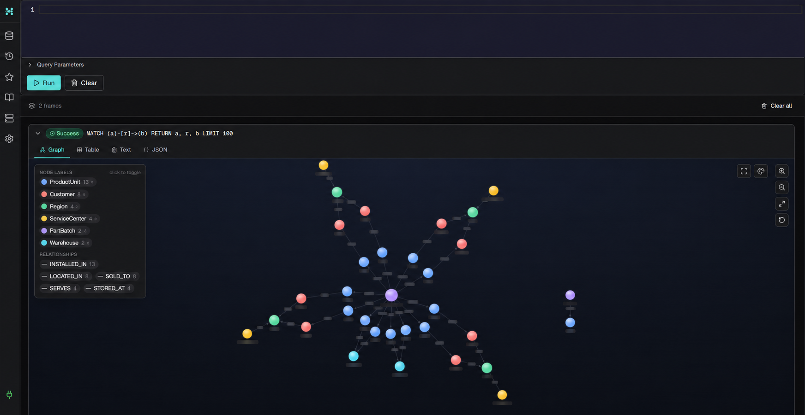

# RecallScope

RecallScope turns a defective-part notification into an explainable recall action plan. Starting with a supplier batch, an operations lead can trace affected product units and customers, see the geographic impact, and decide what needs to happen first.

**Live demo:** [https://recallscope.onrender.com](https://recallscope.onrender.com)

## Where RecallScope runs

RecallScope is hosted as a live web application on **Render** at the demo link above. Render runs the user interface and application server together, so visitors only need a browser to use it.

The application reads its live recall data from **CognoDB Cloud**. CognoDB stores the connections between recalled batches, products, customers, warehouses, regions, and service centres. Database credentials are stored only as private Render environment variables; they are never included in this repository.

```text
Visitor's browser → RecallScope on Render → CognoDB Cloud
```

Every push to the `main` branch on GitHub triggers Render to deploy the latest version automatically.

## Technology stack

| Layer | Technology | Why it is used |
| --- | --- | --- |
| User interface | React + Vite | Fast, responsive single-page dashboard experience |
| Application server | Node.js + Express | Provides the API, error handling, and secure server-side database access |
| Graph database | CognoDB Cloud | Stores and traverses the recall network |
| Database driver | Official Neo4j JavaScript driver | Connects to CognoDB using parameterized Cypher queries |
| Styling | CSS | Lightweight, purpose-built responsive interface with no component-library overhead |
| Hosting | Render Starter web service | Always-on hosted demo for reviewers |
| Source control and delivery | GitHub + Render Blueprint | Versioned code with automatic deployment from `main` |

## The user story

Radian Battery Works flags lithium battery batch `RB-2107` for thermal variance. An operator needs to answer one urgent question: **which products, customers, and operational teams are affected?**

RecallScope returns an actionable summary, a priority queue, and the verified relationship path that explains each customer’s impact.

## Why a graph database?

This product’s most important question is relationship-first: starting from one `PartBatch`, discover every impacted `ProductUnit`, its owner, and their region. The depth of a trace varies as the supply chain grows: batches can reach products through lots, warehouses, repair centres, and resale events.

A relational database can model these records, but every additional supply-chain stage requires another join and makes path explanation awkward. In CognoDB, the traversal is direct and the application can return the exact connected path that led to an impact decision.

```text
(:PartBatch)-[:INSTALLED_IN]->(:ProductUnit)-[:SOLD_TO]->(:Customer)-[:LOCATED_IN]->(:Region)
        │
        └─ batch identifier, supplier, risk, received date
```

## Graph model

| Node | Important properties | Relationship |
| --- | --- | --- |
| `PartBatch` | `id`, `name`, `supplier`, `risk` | `INSTALLED_IN` → `ProductUnit` |
| `ProductUnit` | `id`, `model`, `status` | `SOLD_TO` → `Customer` |
| `Customer` | `id`, `name`, `activeVehicle` | `LOCATED_IN` → `Region` |
| `Region` | `name` | Groups customers for action planning |
| `Warehouse` | `id`, `name`, `city` | Receives affected unsold inventory through `STORED_AT` |
| `ServiceCenter` | `id`, `name` | `SERVES` → `Region` for local recall routing |

The main query in `server/graph.js` performs a parameterized, multi-hop traversal from a recalled batch to product units and their owners. It uses the official `neo4j-driver`; no Cypher is string-concatenated.

### Live graph in CognoDB



*The live CognoDB graph: recalled batches connect to product units, customers, warehouses, regions, and service centres. This is the relationship network RecallScope traverses to turn one batch alert into a clear action plan.*

## Key graph queries

`getAffectedUnits(batchId)` starts at a `PartBatch`, traverses to all installed product units, and follows either the ownership path (`SOLD_TO → LOCATED_IN`) or the inventory path (`STORED_AT`). That single relationship-centric query lets RecallScope distinguish customers who require outreach from stock that can be quarantined.

`createRecallPlan(batchId)` uses `MERGE` to create a durable plan node idempotently. The dashboard rereads the plan state after creation.

The seed includes two battery batches, 13 product units, 8 customers, 2 warehouses, 4 regions, and 4 service centres. Only `RB-2107` is active in the current dashboard; the second batch makes the dataset suitable for extending the recall-history experience.

## Run locally

```bash
npm install
Copy-Item .env.example .env
# Add your CognoDB connection values to .env
npm run seed
npm run dev
```

Open `http://localhost:5173`. Without CognoDB environment variables, the interface intentionally runs in **demo mode**, using the same realistic recall scenario; with the values present, the affected-owner query reads from CognoDB.

## Environment variables

| Variable | Purpose |
| --- | --- |
| `COGNODB_URI` | CognoDB Bolt / `neo4j+s` connection URI |
| `COGNODB_USERNAME` | CognoDB username (typically `cognodb`) |
| `COGNODB_PASSWORD` | CognoDB-generated password |
| `PORT` | Backend port, defaults to `3001` |

## Deploy

Deploy as a Node web service on Render:

1. Push this repository to GitHub and create a Render **Web Service**.
2. Build command: `npm ci && npm run build`.
3. Start command: `npm start`.
4. Add the three `COGNODB_*` variables in Render’s environment settings.
5. Run `npm run seed` once locally against the same CognoDB instance before demonstrating the application.

The included `render.yaml` supplies these commands automatically when you create a Render Blueprint. The application serves both the API and production React client from this single Node service.

The app gracefully reports unavailable database connections rather than exposing connection details to the browser.

## Verification checklist

Before recording the demo, run:

```bash
npm run seed
npm run build
npm run dev
```

Then verify the dashboard loads in live mode, the warehouse action filters to quarantinable stock, an owner opens an explainable path, and **Create recall plan** persists its status after refresh.
